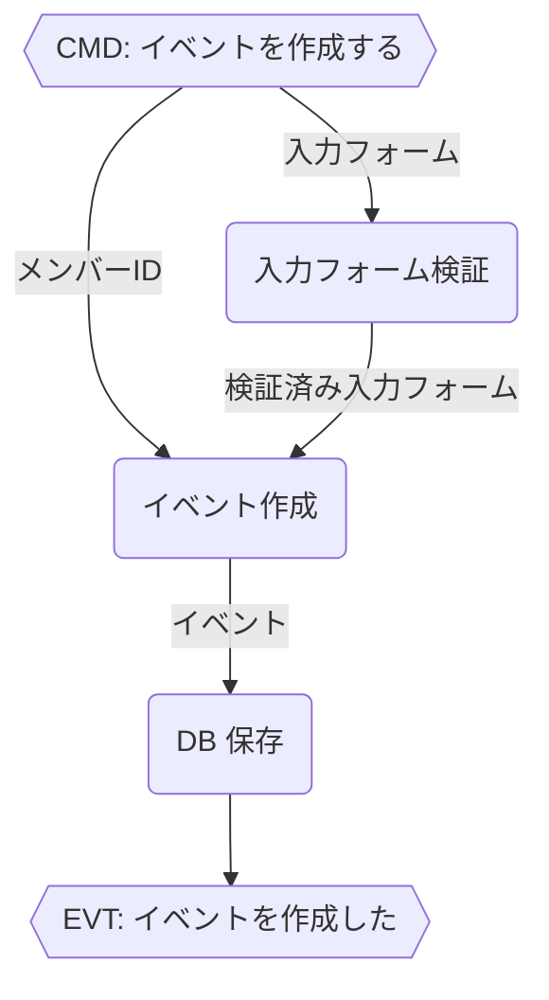
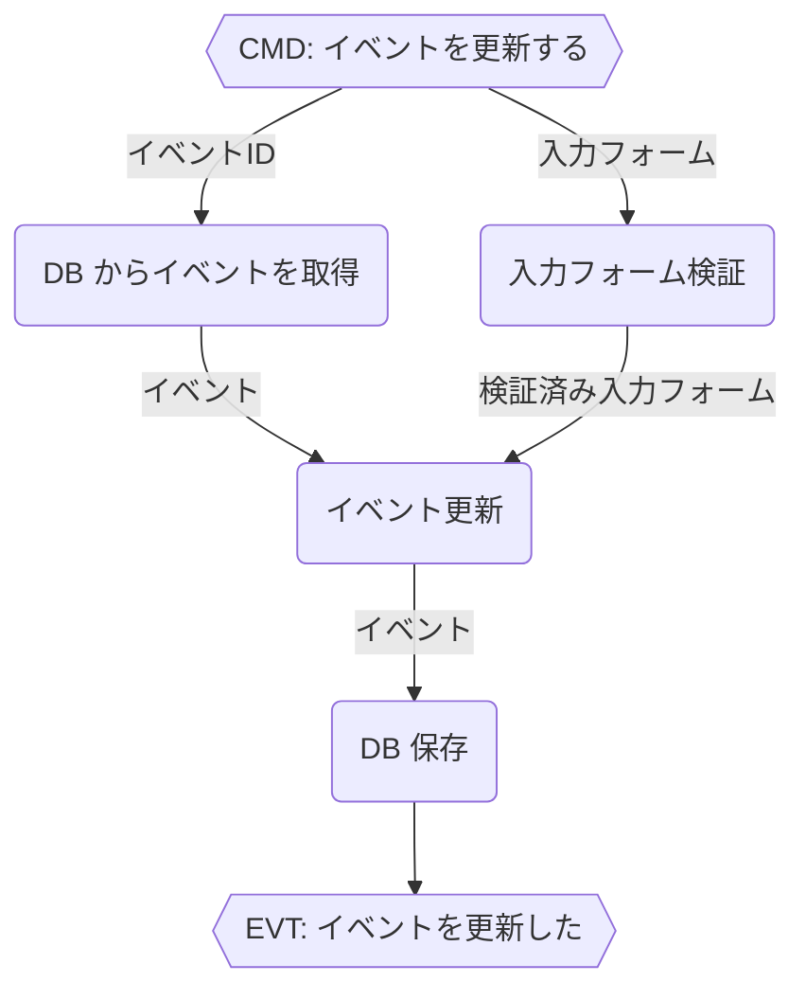
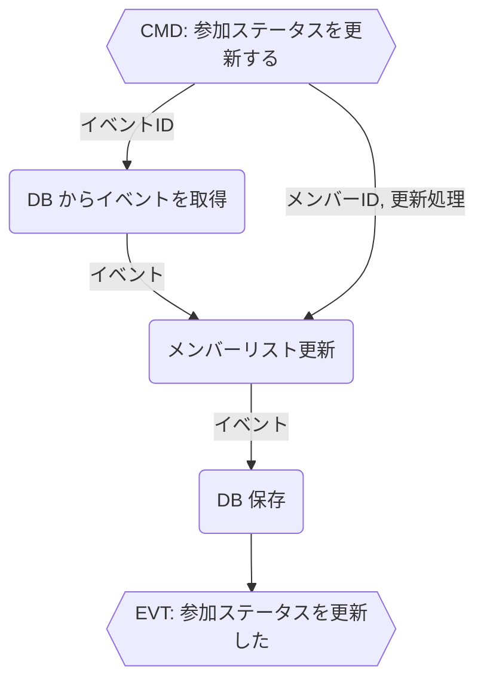

# Event

`Event` は、メンバーが参加する（or したい）イベントのこと。

## Modeling

```typescript
interface イベント {
    イベントID
    イベント名 // 1文字以上のstring
    カテゴリ
    詳細 // string
    開催日 // 日付(1日) | 日付の期間 | 時間の期間
    チケット発売日 // 日付の期間 | 時間の期間 | Null
    メンバーリスト // 重複なしメンバーリスト
}

type メンバー = 行きたいメンバー | 行くメンバー
interface 行きたいメンバー { メンバーID }
interface 行くメンバー { メンバーID }

type カテゴリ = "音楽ライブ"
 | "トークライブ"
 | "演劇"
 | "映画"
 | "フェス"

interface 検証済み入力フォーム {
    イベント名 // 1文字以上のstring
    カテゴリ
    詳細 // string
    開催日 // 日付(1日) | 日付の期間 | 時間の期間
    チケット発売日 // 日付の期間 | 時間の期間 | Null
}

// ----------------------------------
// 関数

// イベント作成
// - イベントIDは新規発行
// - 検証済み入力フォームの内容を入れる
// - 作成者のメンバーID を行きたいメンバーとして追加
const イベント作成 = (
    検証済み入力フォーム,
    作成者のメンバーID,
): イベント

// 更新前イベントを、検証ずみ入力フォームの値で上書き
const イベント更新 = (
    更新前イベント,
    検証済み入力フォーム,
): イベント

const メンバーリスト更新 = (
    更新前イベント,
    メンバーID,
    更新処理, // "削除" | "行きたい" | "行く"
): イベント

// ----------------------------------
// バリデータ

const 入力フォーム検証 = (入力フォーム[DTO]): 検証済み入力フォーム

// ----------------------------------
// ポート

const DBからイベント取得 = (イベントID): イベント
const DB保存 = (イベント)
```

<details>
<summary>カテゴリごとに分けるバージョン（不採用）</summary>

```typescript
interface 音楽ライブ {
    イベントID
    イベント名 // 1文字以上のstring
    詳細 // string or Null
    開催日 // 時間の期間
    チケット発売日 // 日付の期間 | 時間の期間 | Null
    メンバーリスト // 重複なしメンバーリスト
}

interface トークライブ {
    イベントID
    イベント名 // string
    詳細 // string or Null
    開催日 // 時間の期間
    チケット発売日 // 日付の期間 | 時間の期間 | Null
    メンバーリスト // 重複なしメンバーリスト
}

interface 演劇 {
    イベントID
    イベント名 // string
    詳細 // string or Null
    開催日 // 開催期間
    チケット発売日 // 日付の期間 | 時間の期間 | Null
    メンバーリスト // 重複なしメンバーリスト
}

interface 映画 {
    イベントID
    イベント名 // string
    詳細 // string or Null
    公開日時 // 開始日のみ | 開催期間
    チケット発売日 // 日付の期間 | 時間の期間 | Null
    メンバーリスト // 重複なしメンバーリスト
}

interface フェス {
    イベントID
    イベント名 // string
    詳細 // string or Null
    開催日時 // 日付の期間
    チケット発売日 // 日付の期間 | 時間の期間 | Null
    メンバーリスト // 重複なしメンバーリスト
}

type イベント = "音楽ライブ"
 | "トークライブ"
 | "演劇"
 | "映画"
 | "フェス"

 type メンバー = 行きたいメンバー | 行くメンバー
interface 行きたいメンバー { メンバーID }
interface 行くメンバー { メンバーID }
```

</details>

## WorkFlow

### イベントを作成する



### イベントを更新する



### 参加ステータスを更新する


